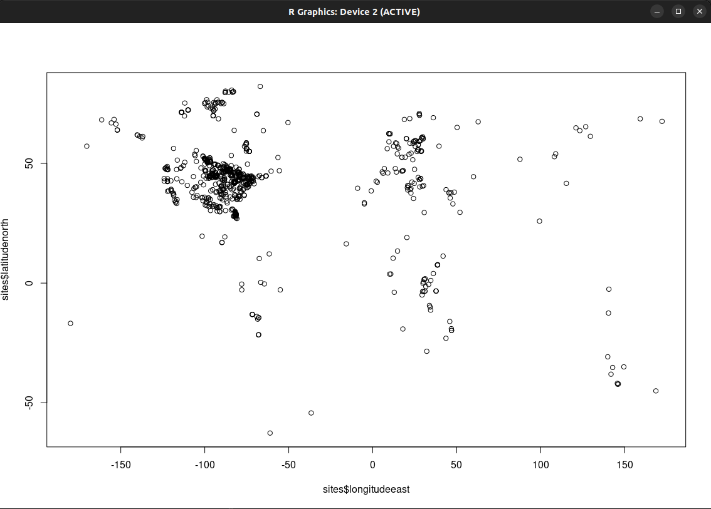

[](https://nsf.gov/awardsearch/showAward?AWD_ID=1948926)

# Neotoma Database Postgres Container

This repository contains the instructions to build and download a Docker container provides the most recent snapshot of the [Neotoma Paleoecology Database](https://neotomadb.org) in a Posgres RMDS. This container will allow the user to use Postgres and PostGIS capabilities without having to directly install the software on their own computer.

The intended user is a "power user" of the Neotoma Database, who has some familiarity with the database and the database structure, and has taken time to examine the updated [Neotoma Database Manual](). Individuals can connect directly to the container using the commandline `psql` application if they have a local installation of Postgres, using a database GUI such as pgAdmin or DBeaver, or using R or Python.

In each case, the Docker container exposes a port (in the examples below we use port `2022`) on the `localhost` for the database `neotoma`.

The main Docker image is stored in DockerHub (and supported by this public git repository). Associated utilites perform commandline or `psql` operations that are intended to occur periodically. By associating them with this repository and the Docker container we can ensure that any operations do not affect the main Neotoma database, or any of its associated services.

## Contributors

This project is an open project, and contributions are welcome from any individual.  All contributors to this project are bound by a [code of conduct](CODE_OF_CONDUCT.md).  Please review and follow this code of conduct as part of your contribution.

* [](https://orcid.org/0000-0002-7926-4935) [Socorro Dominguez Vidana](https://sedv8808.github.io/)
* [](https://orcid.org/0000-0002-2700-4605) [Simon Goring](http://goring.org)

### Tips for Contributing

Issues and bug reports are always welcome.  Code clean-up, and feature additions can be done either through pull requests to [project forks](https://github.com/NeotomaDB/neotoma2/network/members) or [project branches](https://github.com/NeotomaDB/neotoma2/branches).

All products of the Neotoma Paleoecology Database are licensed under an [MIT License](LICENSE) unless otherwise noted.

## Container Use

Users can either build the container locally, or pull a pre-compiled image from DockerHub.  Assuming that Docker is currently installed and running on the user's computer, the easiest way to run the container is to use `docker run`. If you do not have an account on DockerHub (and choose not to create one), or if you wish to build the image from scratch locally, you can use the instructions for Building the Image to create and use the container.

### Using `docker run`

If using the DockerHub image, you will need a [Docker account](https://hub.docker.com/) with a username and password.  The `docker run` command will begin by asking for these credentials. The image is hosted on Socorro Dominguez's DockerHub account, [`sedv8808`](https://hub.docker.com/u/sedv8808), and the following commandline arguments will set up the container locally, with Docker running the Postgres server, and connecting the container port `5432` (the default Postgres port) to a localhost port `2022`. *Please continue reading below for a note about the total build time.*

```bash
docker run --name test -d -p 2022:5432 -v $PWD/out:/tmp -e POSTGRES_PASSWORD=postgres sedv8808/neotoma_postgres postgres
```

Information about `docker run` options and tags can be found in the [documentation for `docker run`](https://docs.docker.com/engine/reference/commandline/run/). Here we describe the specific tags used in the above command:

* `-- name` : This is the Docker image name, here we are setting the name to `test`, but this can be changed as needed.
* `-d` : Run the container in the background (detached). This frees up the commandline terminal once the container is started.
* `-p` : Define the localhost port that open container ports will point to. Postgres, by default, uses port `5432`. We use the format `USER`:`CONTAINER`, so this is saying that the user's `localhost:2022` is connected to the container's `localhost:5432`.  You can use `5432:5432` if you wish, but this may cause a conflict if there is a local version of Postgres running.
* `-v` : Link external folders to a folder within the container.  Again we use the `USER`:`CONTAINER` format. Here, the `$PDW/out` folder (`$PWD` representing the current working directory) is linked to the folder `tmp` within the container. We use the root `/tmp` folder so that any user (e.g., `postgres` user) can have access to the connected folder.
* `-e POSTGRES_PASSWORD` : Within the container set the environment variable `POSTGRES_PASSWORD`, which will be used for the default `postgres` user.

The docker image itself lives at `sedv8808/neotoma_postgres` on DockerHub, and the term `postgres` at the end of the `docker run` command initializes Postgres within the container.

Once you're done with the image you can stop it from running in memory using `docker stop test` (depending on the name you give it), and, if you want to start it again you can use `docker start test`.  This will preserve any changes you have made to the container so that (for example) if you've deleted records in the container, or made modifications to the database structure, those changes will persist when you open it again.

If you made changes to the container that you do not want to persist, you will stop the container, delete it, and then, you can rebuild it:

```bash
docker stop test
docker rm test
docker run --name test -d -p 2022:5432 -v $PWD/out:/tmp -e POSTGRES_PASSWORD=postgres sedv8808/neotoma_postgres postgres
```

In this case we won't see the files downloading, but the container will take several minutes to initialize as it downloads the latest snapshot of Neotoma and restores it locally. Running `psql` too early will result in the error:

```bash
$ psql -h localhost -p 2022 -U postgres -d neotoma
psql: error: connection to server at "localhost" (127.0.0.1), port 2022 failed: server closed the connection unexpectedly
        This probably means the server terminated abnormally
        before or while processing the request.
```

Timing with the `timetesting.sh` script (included) seems to indicate an average of between 90 -- 120s before the container is fully ready for interaction through `psql` or other DB tools.

#### In Plain English

We take the image at `sedv8808/neotoma_postgres` and build it locally, naming it `test`. Within the container we execute the command `postgres`, which starts the Postgres server. Traffic through the container's port `5432` is connected to the user port `2022`, and all files in the user's `out` folder, are connected to the folder called `/tmp` inside the container, which allows us to move files out of the container if needed.

### Building the Image Locally

This GitHub repository includes a Dockerfile. If you would rather build the image in your local machine:

* Clone the repository locally using `git clone https://github.com/NeotomaDB/NeotomaPostgres`
* Navigate to the folder using the commandline, and run:

```bash
docker build -t neotoma_postgres .
```

With the container now built and stored in your system you can start running Postgres. To start the image, first run:

```bash
docker run --name test -d -p 2022:5432 -v $PWD/out:/tmp --rm -e POSTGRES_PASSWORD=postgres neotoma_postgres postgres
```

There is likely a delay required to wait while the `sql` dump is restored locally. Running `psql` too early will result in the error:

```bash
$ psql -h localhost -p 2022 -U postgres -d neotoma
psql: error: connection to server at "localhost" (127.0.0.1), port 2022 failed: server closed the connection unexpectedly
        This probably means the server terminated abnormally
        before or while processing the request.
```

Local testing by SJG suggests that this can take ~ 1.5 minutes.

#### Pushing to DockerHub

If you make changes to the Docker container and wish to save the modified image for future use on other computers/servers, you can create a DockerHub account, and create the image remotely using your `<username>` (*e.g.*, `sjgoring`) and a `<tag>` for the image (for example, `mybuild`):

```bash
docker tag neotoma_postgres:latest <username>/neotoma_postgres:<tag>
docker push <username>/neotoma_postgres:<tag>
```

For example:

```bash
docker tag neotoma_postgres:latest sjgoring/neotoma_postgres:latest
docker push sjgoring/neotoma_postgres:latest
```

## Working with the Container

### With Postgres Installed locally

Assuming you have Postgres install locally you can work directly with the Neotoma image using `psql`:

#### Querying Neotoma Directly

Here we will run the Docker container, open `psql` and export the results of a query to file:

```bash
$ docker run --name test -d -p 2022:5432 -v $PWD/out:/tmp -e POSTGRES_PASSWORD=postgres sedv8808/neotoma_postgres postgres
$ psql -h localhost -p 2022 -d neotoma -U postgres

neotoma=# \copy (SELECT * FROM ndb.sites WHERE sitename LIKE 'Lake%') TO '/tmp/lakesofneotoma.csv' csv;
```

After opening up `psql` at the appropriate port and with the appropriate user name, we use the `\copy` command for `psql` to define where the output should go.  In this case we're sending it to our `tmp` folder.  We then query for all sites in Neotoma that start with the word *Lake*, and make sure we define the output as a csv. When we exit the container using `docker stop test`, the data remains in the `tmp` folder.

## Connecting with R

Given that you've started the Docker container before starting R (and waited the required time, as indicated above), you can start up R and use the `RPostgreSQL` package:

```R
library(RPostgreSQL)

conn <- dbConnect(dbDriver('PostgreSQL'), 
                 dbname = 'neotoma',
                 host = 'localhost', 
                 port = 2022,
                 user = 'postgres', 
                 password = 'postgres')

sites <- dbGetQuery(conn, "SELECT * FROM ndb.sites WHERE sitename LIKE 'Lake%'")
plot(sites$latitudenorth ~ sites$longitudeeast)
```


